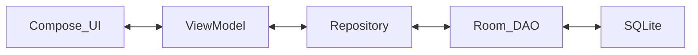

# 🤖 Instruções para Agentes de Inteligência Artificial (AI_CONTEXT)

> **Nota para Agentes IA:** Leia este documento atenciosamente ao ser invocado. Ele descreve o escopo histórico, decisões de arquitetura cruciais, e "pegadinhas" de dependências que afetam o repositório `Meus Remedinhos`.

---

## 📖 1. Histórico e Contexto de Engenharia

Este aplicativo nasceu com o objetivo de gerenciar o consumo de medicações ("Meus Remedinhos").

- **Versão 1:** PWA (Progressive Web App). **Falhou** porque Service Workers não suportam alarmes agendados exatos confiáveis nos navegadores web mobile.
- **Versão 2:** React Native. **Falhou** porque o suporte a Widgets de Tela Inicial era baseado em plugins antigos de terceiros repletos de bugs.
- **Versão Atual:** Android Nativo (Kotlin). **Sucesso**. Escolhemos tecnologias modernas (Jetpack Compose, Room KSP2, AlarmManager) para obter controle total do sistema do usuário (Widgets, Doze Mode, Notificações Nativas).

---

## 🏗 2. Arquitetura do Software (Overview)

Você deve seguir restritamente o padrão **MVVM Clean Architecture**:

- `com.franciscokahil.appMeusRemedinhos.ui.*`: UI inteiramente construída em [Jetpack Compose](https://developer.android.com/jetpack/compose).
- `com.franciscokahil.appMeusRemedinhos.data.*`: Camada de persistência.
  - Banco: **[Room Database](https://developer.android.com/training/data-storage/room)**.
  - O [DAO](app/src/main/java/com/example/meusremedinhos/data/local/EventDao.kt) deve SEMPRE retornar um `Flow<List<T>>` para listas, garantindo a reatividade contínua na UI através do [`StateFlow`](https://kotlinlang.org/api/kotlinx.coroutines/kotlinx-coroutines-core/kotlinx.coroutines.flow/-state-flow/).
- `com.franciscokahil.appMeusRemedinhos.background.*`: Todo o trabalho agendado pelo SO. O [`AlarmScheduler`](app/src/main/java/com/example/meusremedinhos/background/AlarmScheduler.kt) usa [AlarmManager](https://developer.android.com/training/scheduling/alarms) (nunca WorkManager) para alarmes com horários rígidos precisos.
- `com.franciscokahil.appMeusRemedinhos.widget.*`: Usa o pacote `androidx.glance` para desenhar o widget da tela inicial. NÃO use RemoteViews baseadas em XML, use o [`GlanceAppWidget`](https://developer.android.com/develop/ui/compose/glance).

---

## ⚠️ 3. Restrições Estritas de Dependência e Gradle

Você deve ter **extrema cautela** ao atualizar bibliotecas de build:

Sempre dê preferência às versões que já no projeto, não tente upgrade nem downgrade sem antes pedir permissão e explicar o motivo detalhadamente e com links para o usuário!!!!

## 💻 4. Lógica de Testes Automatizados

Se você (Agente) receber a ordem para escrever testes:

- **UI:** Coloque na pasta `app/src/androidTest/`. Use `createComposeRule()`. Isole as funções filhas anotadas com `@Composable`, não instancie o ViewModel dentro do teste se não for necessário.
- **DAO:** Coloque na pasta `app/src/androidTest/`. Instancie o banco com `Room.inMemoryDatabaseBuilder().allowMainThreadQueries().build()` para garantir que ele apague logo depois do teste e não dependa de Coroutine Dispatchers lentos.
- **ViewModel:** Coloque na pasta `app/src/test/` (rodando na JVM hospedeira). Lembre-se de configurar o `Dispatchers.setMain` do Kotlinx Coroutines, caso contrário fluxos falharão.

---

## 📝 5. Prompting Behaviors

- O ambiente do host de desenvolvimento preferencial é o **Ubuntu LTS no Distrobox**, `distrobox enter ubuntu22-android` contendo dependências C++ (lib32z1). Nunca use comandos `apt-get` ou assuma privilégios de root, a menos que autorizado explicitamente.

- O Android Studio roda no distrobox ubuntu22-android, e o emulador no ambiente host.
