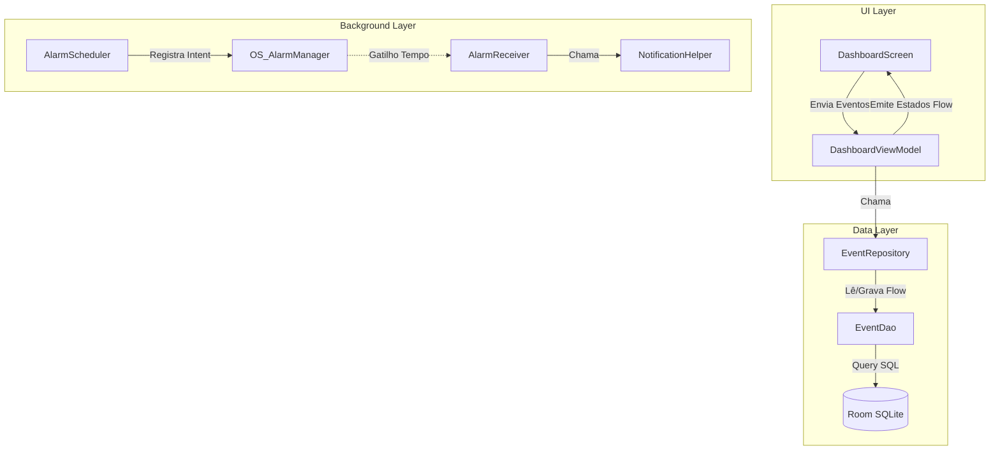

# 💊 Meus Remedinhos (Nativo)

Bem-vindo ao repositório oficial do **Meus Remedinhos**, um aplicativo de rastreamento e lembretes de medicações totalmente nativo para Android.

## 📚 Índice

1. [Visão Geral](#-visão-geral)
2. [Tecnologias Utilizadas](#-tecnologias-utilizadas)
3. [Requisitos e Dependências](#-requisitos-e-dependências)
4. [Como Rodar Localmente](#-como-rodar-localmente)
5. [Como Rodar os Testes](#-como-rodar-os-testes)
6. [Como Publicar](#-como-publicar)
7. [Arquitetura e Fluxo de Dados](#-arquitetura-e-fluxo-de-dados)
8. [Melhores Práticas](#-melhores-práticas)

---

## 🎯 Visão Geral

Este aplicativo foi concebido inicialmente como um PWA e posteriormente reescrito em React Native, até finalmente encontrar seu lar definitivo em **Android Nativo (Kotlin)** para suportar de forma robusta e confiável Alarmes em Background, Room Database, e Widgets Nativos (Jetpack Glance).

---

## 🛠 Tecnologias Utilizadas

O projeto adota o padrão moderno do ecossistema Android:

- **Linguagem:** [Kotlin](https://kotlinlang.org/docs/home.html)
- **UI Toolkit:** [Jetpack Compose](https://developer.android.com/jetpack/compose) & Navigation3
- **Widgets:** [Jetpack Glance ](https://developer.android.com/develop/ui/compose/glance)
- **Persistência Local:** [Room Database](https://developer.android.com/training/data-storage/room) com [KSP](https://kotlinlang.org/docs/ksp-overview.html)
- **Arquitetura:** MVVM (Model-View-ViewModel) via [`StateFlow`](https://kotlinlang.org/api/kotlinx.coroutines/kotlinx-coroutines-core/kotlinx.coroutines.flow/-state-flow/)
- **Agendamento em Background:** [AlarmManager](https://developer.android.com/training/scheduling/alarms)
- **Build System:** [Gradle (Kotlin DSL, AGP 9.0+)](https://developer.android.com/build)

---

## 📦 Requisitos e Dependências

- **JDK:** Java 17 (OpenJDK 17)
- **Android Studio:** Ladybug ou mais recente (com suporte nativo ao AGP 9.0+)
- **Android SDK:** Nível de API 34+ (Android 14)

_(Nota: Para usuários Linux, recomendamos o uso de um container Distrobox com Ubuntu 22.04 LTS para melhor compatibilidade com emuladores de KVM)._

---

## 🚀 Como Rodar Localmente

> [!IMPORTANT]
> Se você está usando o ambiente **Distrobox** configurado neste projeto, consulte o [**DISTROBOX_GUIDE.md**](DISTROBOX_GUIDE.md) para instruções específicas de caminhos e comandos.

1. **Clone o repositório e navegue até a pasta:**
   ```bash
   cd med-tracker/Kotlin
   ```
2. **Abra o projeto no Android Studio:**
   Abra a IDE, selecione "Open" e aponte para o diretório `Kotlin`.
3. **Sincronize o Gradle:**
   O Android Studio pedirá para baixar as dependências e o Gradle Wrapper.
4. **Rode no Emulador ou Dispositivo Físico:**
   Clique no botão de "Play" (Run) ou utilize o terminal:
   ```bash
   ./gradlew assembleDebug
   ```
   _(O APK gerado ficará em `app/build/outputs/apk/debug/`)_

---

## 🧪 Como Rodar os Testes

Temos testes cobrindo Camada de Dados (Room), Camada de UI (Compose) e ViewModel.

> [!TIP]
> No ambiente Distrobox, use os comandos detalhados em [**DISTROBOX_GUIDE.md**](DISTROBOX_GUIDE.md).

- **Para rodar Testes Unitários (Rápidos, rodam na JVM Local):**
  ```bash
  ./gradlew testDebugUnitTest
  ```
- **Para rodar Testes Instrumentados (Necessita de Emulador Ativo):**
  _(Testa o SQLite do Android e o Compose UI Rendering)_
  ```bash
  ./gradlew connectedAndroidTest
  ```

---

## 📦 Como Publicar (Release)

Para gerar uma versão de produção para a Google Play Store:

1. Gere ou obtenha a sua chave de assinatura (Keystore `.jks`).
2. Adicione os dados da Keystore no `build.gradle.kts` ou crie variáveis de ambiente.
3. Gere o Android App Bundle (AAB):
   ```bash
   ./gradlew bundleRelease
   ```
4. O arquivo final `.aab` (que é muito menor e otimizado) estará na pasta `app/build/outputs/bundle/release/`. Suba este arquivo no [Google Play Console](https://play.google.com/console).

---

## 🏛 Arquitetura e Fluxo de Dados

O projeto segue a arquitetura oficial recomendada pelo Google, garantindo baixo acoplamento e reatividade através do `StateFlow`.



### Comunicação entre Componentes

1. O `DashboardViewModel` mantém a verdade absoluta do estado da UI em memória usando `MutableStateFlow`.
2. Qualquer interação (como marcar um remédio como tomado) chama um método no ViewModel.
3. O ViewModel envia a mudança de estado para o banco de dados (`EventDao.insertEvent`).
4. Como o DAO retorna um `Flow<List<EventEntity>>`, a simples gravação no banco faz a UI reagir e se desenhar instantaneamente.

---

## 💎 Melhores Práticas

- **Não use o KAPT:** Migramos para o **[KSP2](https://kotlinlang.org/docs/ksp-overview.html)**. Mantenha a paridade de versões entre Kotlin e KSP.
- **Isolamento de UI:** Todo componente [Compose](https://developer.android.com/jetpack/compose) (ex: [`EventCard`](app/src/main/java/com/example/meusremedinhos/ui/dashboard/EventCard.kt)) não deve depender de repositórios. Ele recebe os parâmetros (`String`, `Boolean`) e passa os cliques via funções de callback (`onCheckedChange = {}`).
- **Nomes em Português:** Para facilitar a familiaridade do time, o idioma central das Strings (`strings.xml`) é PT-BR. Use o arquivo de recursos para _qualquer_ texto novo.
- **Imutabilidade:** As Entity classes do [Room](https://developer.android.com/training/data-storage/room) ([`EventEntity`](app/src/main/java/com/example/meusremedinhos/data/local/EventEntity.kt)) devem ser sempre `data class` imutáveis. Em vez de editar a classe, envie uma cópia com `.copy()` ao ViewModel.
