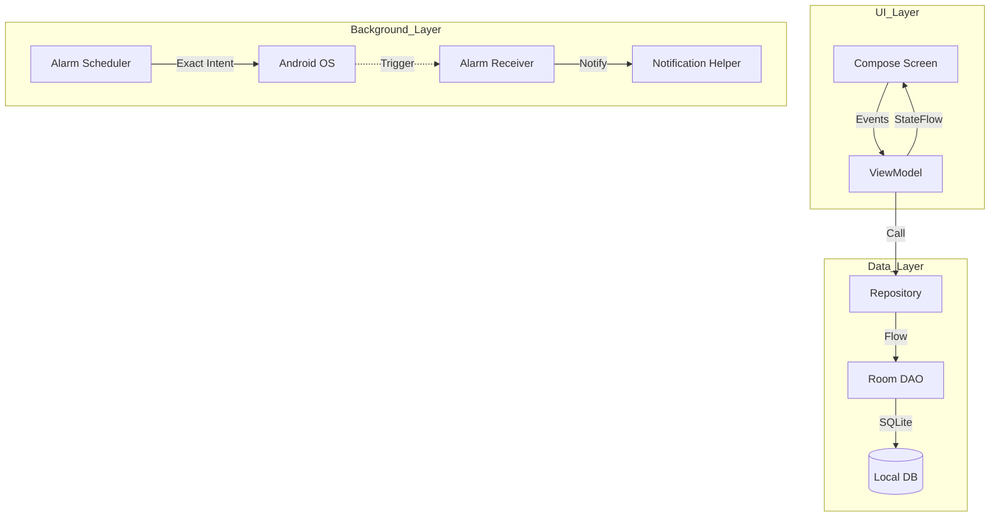

# 💊 Meus Remedinhos (Med Tracker)

**A reliable, offline-first Android application for medication tracking and reminders.** 

Evolved from PWA → React Native → **Kotlin Native** to unlock robust background alarms, millisecond-precision scheduling, and modern native widgets.

---

## 🎯 Vision & Purpose

**Meus Remedinhos** is designed for simplicity and reliability. It serves elderly users, chronic patients, and caregivers who need a "set and forget" solution that works 100% of the time, even without an internet connection.

### Core Promises
- 🔔 **100% Reliable Reminders**: Uses system-level exact alarms that survive Doze Mode.
- 🔐 **Privacy First**: All data is stored locally in an encrypted Room database. No data ever leaves the device.
- ♿ **High Accessibility**: Senior-friendly UI with large touch targets, high contrast, and full screen reader support.
- 📊 At-a-Glance Status: Native home screen widgets to track your day without opening the app.

---

## 🛠 Tech Stack

- **Linguagem:** Kotlin 2.x with Coroutines & Flow
- **UI Framework:** Jetpack Compose (Material Design 3)
- **Navigation:** Type-safe Navigation Compose
- **Database:** Room SQLite (via KSP2)
- **Background:** AlarmManager (Exact Alarms)
- **Widgets:** Jetpack Glance
- **Testing:** MockK, Turbine, Compose UI Test, JaCoCo

---

## 🚀 Getting Started

### Prerequisites
- Android Studio **Ladybug (2024.1.1)** or later.
- JDK **17**.
- Android SDK **34+** (Android 14).

### Local Execution
1. Clone the repository.
2. Open the `Kotlin` folder in Android Studio.
3. Sync Gradle and run the `:app` module.

> [!TIP]
> For Linux users, we recommend using a **Distrobox** container for a consistent build environment. See [Distrobox Guide](docs/DISTROBOX_GUIDE.md).

---

## 🧪 Testing

The project maintains a **75%+ code coverage** across critical business logic.

- **Unit Tests:** `./gradlew testDebugUnitTest` (Logic, ViewModels, Repositories)
- **Instrumented Tests:** `./gradlew connectedAndroidTest` (UI, Database, Deep-links)

Detailed testing documentation can be found in [docs/TESTING.md](docs/TESTING.md).

---

## 🏛 Architecture

The app follows the **MVVM (Model-View-ViewModel)** pattern with a reactive data layer.

---

## 📚 Documentation Roadmap

| Document | Description |
| :--- | :--- |
| [**Product Guide**](docs/PRODUCT_GUIDE.md) | Features, user flows, and roadmap. |
| [**Developer Guide**](docs/DEVELOPER_GUIDE.md) | Setup, project structure, and coding patterns. |
| [**Testing Guide**](docs/TESTING.md) | How to run tests and coverage reports. |
| [**Glossary**](docs/GLOSSARY.md) | Domain terms used in the project. |
| [**Features**](docs/FEATURES.md) | Technical breakdown of implemented features. |

---

## 📄 License

This project is licensed under the MIT License - see the [LICENSE](LICENSE) file for details.

---

*Made with ❤️ for better health tracking.*
