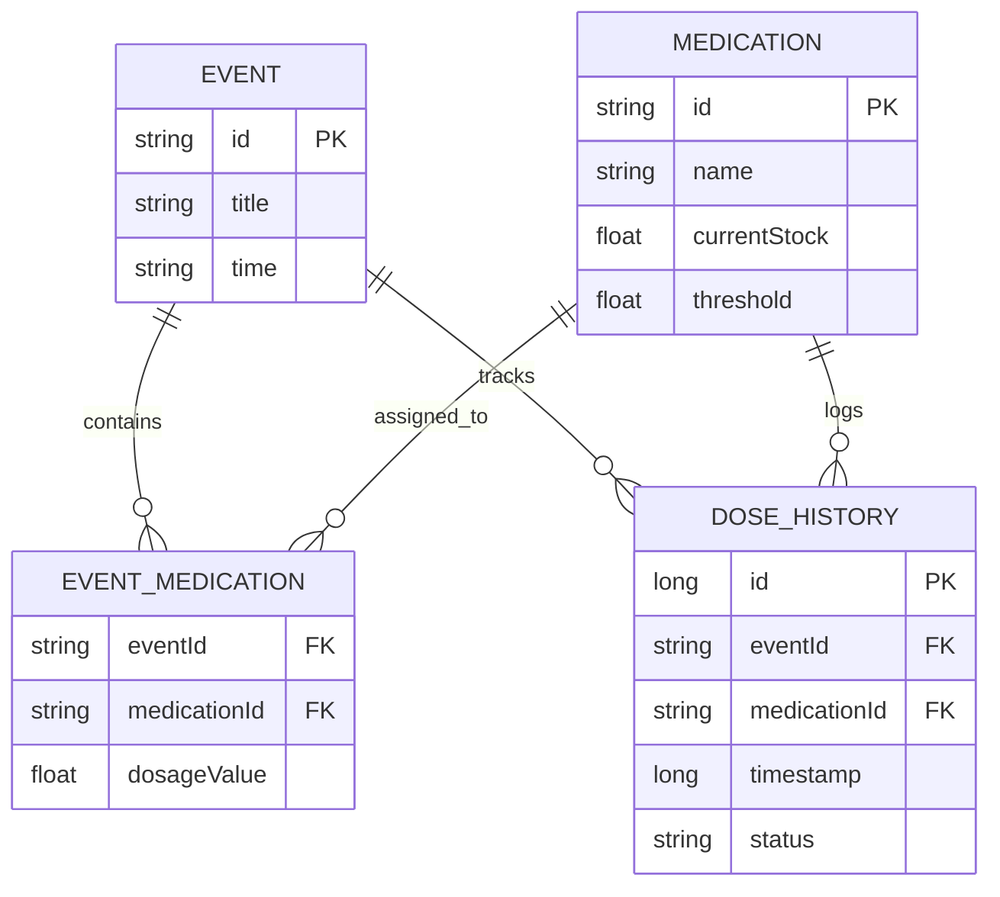

# 🗄️ Inventory Database Schema

> Detailed representation of the Room database entities and relationships for the new inventory system.

---

## 1. Entity: Medication (Updated)
The existing `Medication` class will be promoted from a simple data class to a full Room **Entity** to allow for autocomplete and centralized stock management.

| Field | Type | Description |
| :--- | :--- | :--- |
| **id** (PK) | String | UUID for the medication. |
| **name** | String | Name of the medication (e.g., "Aspirin"). |
| **currentStock** | Float | Total amount available. Used `Float` to support fractional doses (e.g., 0.5 pill or 2.5 ml). |
| **lowStockThreshold** | Float | Point at which the app triggers a refill reminder. |
| **defaultDosageUnit** | String | The unit associated with this medication (e.g., "💊 Pill"). |

## 2. Entity: EventEntity (Updated)
Refactored to reference `Medication` IDs instead of holding a list of names.

| Field | Type | Description |
| :--- | :--- | :--- |
| **id** (PK) | String | UUID for the event. |
| **title** | String | Event name (e.g., "Breakfast"). |
| **time** | String | "HH:MM" format. |
| **isEnabled** | Boolean | Whether the alarm is active. |
| **icon** | String | Emoji or resource ID. |

## 3. Entity: EventMedication (New - Link Table)
Handles the many-to-many relationship. A single medication can belong to multiple events (e.g., Aspirin at Breakfast and Dinner).

| Field | Type | Description |
| :--- | :--- | :--- |
| **eventId** (FK) | String | Reference to `EventEntity`. |
| **medicationId** (FK) | String | Reference to `Medication`. |
| **dosageValue** | Float | Specific amount to take at this event (e.g., 2.0). |

## 4. Entity: DoseHistory (New)
Records every time a medication is actually taken to ensure inventory accuracy.

| Field | Type | Description |
| :--- | :--- | :--- |
| **id** (PK) | Long | Auto-increment ID. |
| **eventId** | String | Which event triggered the dose. |
| **medicationId** | String | Which medication was taken. |
| **timestamp** | Long | Unix timestamp of when it was marked as taken. |
| **amountTaken** | Float | Amount subtracted from stock at that time. |
| **status** | String | "TAKEN" or "SKIPPED". |

---

## 🗺️ Relationship Diagram

