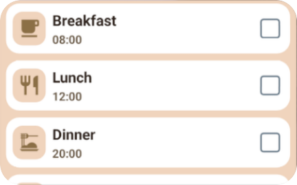

# Meus Remedinhos (MedTracker) 💊

> Um aplicativo mobile open-source simples, para pessoas que precisam tomar remédios regularmente, para acompanhamento e lembretes de medicamentos, desenvolvido com React Native e Expo.



O **Meus Remedinhos** nasceu como um PWA e agora evoluiu para sua versão 2.0: um aplicativo React Native com suporte a notificações locais e Widgets interativos para Android.


## 📱 Funcionalidade de Widgets (Android)

Uma das maiores novidades da versão 2.0 é o suporte nativo a Widgets no Android. Eles foram construídos diretamente em React Native e compilados para views nativas, permitindo que o usuário interaja com sua lista de medicamentos sem precisar abrir o app principal!

## 📱 Funcionalidades

- **Notificações Locais Confiáveis**: Lembretes diários que funcionam mesmo offline.
- **Gerenciamento de Rotina**: Organize seus horários (Café, Almoço, Jantar, etc).
- **Lista de Medicamentos**: Associe múltiplos remédios a cada horário.
- **Offline First**: Seus dados ficam no seu dispositivo. Privacidade total.
- **Interface Simples**: Texto grande, alto contraste e fácil de usar.
- **Widgets para Android:** Acompanhe sua lista diária ou o próximo medicamento direto da tela inicial usando `react-native-android-widget`.
- **Multilíngue:** Suporte nativo para Português (pt-BR) e Inglês (en-US).

## 🛠 Tecnologias

- **[React Native](https://reactnative.dev/)** + **[Expo](https://expo.dev/)** (SDK 54)
- **TypeScript**
- **SQLite** (Expo SQLite) para persistência de dados.
- **Expo Notifications** para agendamento local.
- **Expo Router** para navegação.
- **React Native Android Widget** para os widgets nativos

## 🚀 Como Rodar

1. Instale as dependências:
```bash
npm install
```

2. Inicie o projeto:
```bash
npm start
```

3. Escolha a plataforma:
- Pressione `a` para Android (Emulador ou Dispositivo via USB).

## 📂 Estrutura do Projeto

- `/app`: Telas e rotas (Expo Router).
- `/components`: Componentes reutilizáveis (MedicationList, etc).
- `/constants`: Estilos, Temas e Configurações estáticas.
- `/services`: Lógica de Banco de Dados e Notificações.
- `/assets`: Imagens e fontes.
- `/.ai`: Documentação do projeto (PRD, Requisitos, Funcionalidades).

## 🤝 Contribuição

Projeto Open Source sob licença MIT. Sinta-se à vontade para abrir Issues ou Pull Requests.


## 🚀 Rodar com codigo nativo (não serve mais só o npm start)

1. Clone o repositório:
```bash
git clone https://github.com/codexico/med-tracker.git
cd med-tracker
```

2. Instale as dependências:
```bash
npm install
```

3. buildar onde o java 17 está instalado:
```bash
npx eas build --profile development --platform android --local
```

4. instalar o apk no emulador
```bash
adb install {path do priojeto}/med-tracker/RN/build-{build_number}.apk
```

5. rodar o app no emulador:
```bash
npx expo start --dev-client
```
Escolher a opção 'a' para Android.

6. acompanhar os logs:
```bash
npx react-native log-android
```

"Licensed under the Open Software License version 3.0" + EULA

---
Feito com ❤️ por [Codexico](https://codexico.com.br).